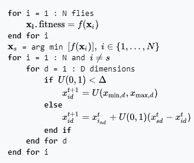

# Dispersive Flies Optimisation (DFO)

## Summary
Dispersive flies optimisation (DFO) is a bare-bones swarm intelligence algorithm which is inspired by the swarming behaviour of flies hovering over food sources. DFO is a simple optimiser which works by iteratively trying to improve a candidate solution with regard to a numerical measure that is calculated by a fitness function. Each member of the population, a fly or an agent, holds a candidate solution whose suitability can be evaluated by their fitness value. Optimisation problems are often formulated as either minimisation or maximisation problems.

DFO was introduced with the intention of analysing a simplified swarm intelligence algorithm with the fewest tunable parameters and components. In the first work on DFO, this algorithm was compared against a few other existing swarm intelligence techniques using error, efficiency and diversity measures. It is shown that despite the simplicity of the algorithm, which only uses agents’ position vectors at time t to generate the position vectors for time t + 1, it exhibits a competitive performance. Since its inception, DFO has been used in a variety of applications including medical imaging and image analysis as well as data mining and machine learning.

## Algorithm

## Resources
1. [Wikipedia](https://en.wikipedia.org/wiki/Dispersive_flies_optimisation)